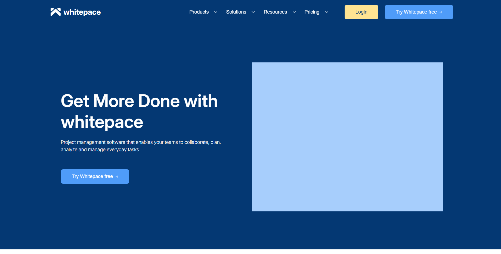

# Whitepace Лендинг по макету фигма.
Проект представляет собой классический одностраничынй сайт о продукте Whitepace, реализованый с использованием классических инустрментов веб-разработки.

## Ссылка на рабочий сайт развёрнутый через хостинг GitHubPages: [Посмотреть проект]()
## Ссылка на GitHub: [Посмотреть код](https://github.com/AncientSteal/Whitepace-lending-by-figma-layout./)

#### Whitepace - SaaS Landing Page дизайн разработан и предоставлен в бесплатный доступ\ Al Razi Siam @alrazisiam Email: siam.alrazi@gmail.com Helsinki, Finland.
***

## 🛠 Технологический стек

 


## ❎ Структура проекта

```
*/
├── images/ изображения
├── vendor/ # папка шрифтов
├── js/ # скрипты JavaScript
├── styles/ # папка стилей
├── index.html # главный файл со структурой сайта
└── README.md
```

## 🚀 Основные возможности

* Удобное меню для навигации по сайту
* Отзывчивый интерфейс
* Формы с кастомной валидацией
* Имитация ответа от сервера реализована черех *alert* сообщения

## 📸 Скриншот каталога товаров


## 📦 Как запустить локально

1. Клонируйте репозиторий: `git clone https://github.com/AncientSteal/Game-Items-STORE-V.2`
2. Запустите файл index.html

## Об авторе
Безлепкин Артур Александрович, начинающий фронтэнд разработчик. 
Ссылка на мой профиль: [ВКонтакте](https://vk.com/oracleelder)

